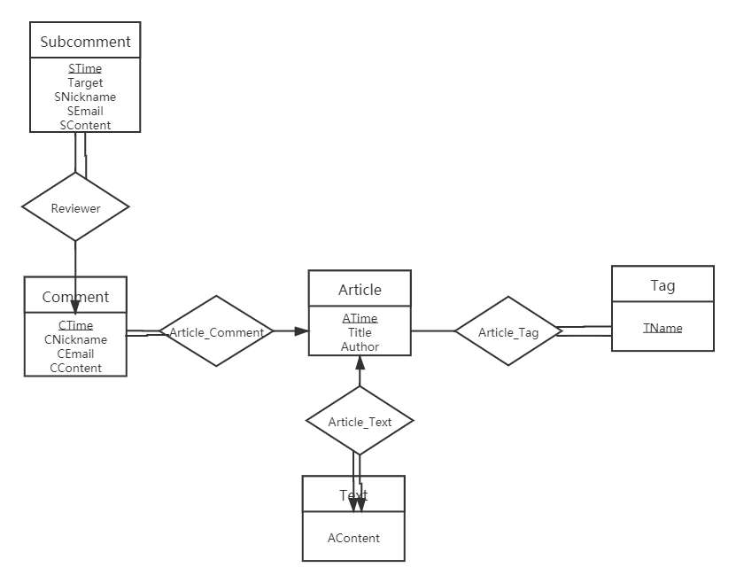

# simple-blog-website

## 部署

src/init.sql

## 数据库

### ER图



### 表

1. Article
    - ATime datetime(6)
    - Title varchar(50)
    - Author varchar(50)
    - primary key(ATime)
2. Tag
    - TName varchar(50)
    - ATime datetime(6)
    - foreign key(ATime) references Article(ATime) on delete cascade
    - primary key(TName, ATime)
3. Text
    - ATime datetime(6)
    - AContent longtext
    - foreign key(ATime) references Article(ATime) on delete cascade
    - primary key(ATime)
4. Comment
    - CTime datetime(6)
    - ATime datetime(6)
    - CNickname varchar(50)
    - CEmail varchar(50)
    - CContent text
    - foreign key(ATime) references Article(ATime) on delete cascade
    - primary key(CTime, ATime)
5. Subcomment
    - STime datetime(6)
    - CTime datetime(6)
    - ATime datetime(6)
    - Target varchar(50)
    - SNickname varchar(50)
    - SEmail varchar(50)
    - SContent text
    - foreign key(CTime) references Content(CTime) on delete cascade
    - foreign key(ATime) references Article(ATime) on delete cascade
    - primary key(STime, CTime, ATime)

### 统一接口

1. 未实现select的统一接口，因为select操作不太统一。
2. update按照主键值搜索，更新任意指定属性（主键外属性顺序可调换）。
3. delete按照主键值搜索，删除。
4. 保证request的前四个parameter分别是重定位地址，失败重做次数，表明，主键，如下：

    ```jsp
    <!-- 重定位地址 -->
    <input name = "insert_demo.jsp" type = "hidden">
    <!-- 失败重做次数 -->
    <input name = "100" type = "hidden">
    <!-- 表名 -->
    <input name = "Article" type = "hidden">
    <!-- 主键，时间属性 -->
    <input name = "datetime" value = "ATime" type = "hidden">
    ```

5. 对于insert和update，还需要其他属性，因此保证request接下来的parameter分别是表其他属性数量，其他属性，如下：

    ```jsp
    <!-- 表其他属性数量 -->
    <input name = "2" type = "hidden">
    <!-- 普通属性 -->
    Title:<input name = "Title" type = "text"><br>
    Author:<input name = "Author" type = "text"><br>
    ```

6. 由于这些操作可能会不断redo，想要使用最后一次redo的datetime作为属性值，则需要name设为"datetime"，value设为属性名，如下：

    ```jsp
    <!-- 主键，时间属性 -->
    <input name = "datetime" value = "ATime" type = "hidden">
    ```

7. 完整示例代码见insert_demo.jsp，update_demo.jsp，delete_demo.jsp。
